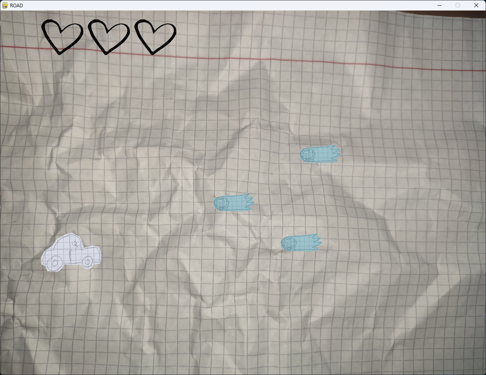

# paperGame
Moja pierwsza stworzona gra w pygame.
W folderze "Gra" można znależć plik .exe uruchamiający całą grę. 

## Rozgrywka

Gra polega na omijaniu swoim pojzadem nadlatujących pocisków, jeśli jedna z nich trafi w nas tracimy życie. 

## Sterowanie
[W] - góra

[S] - dół
